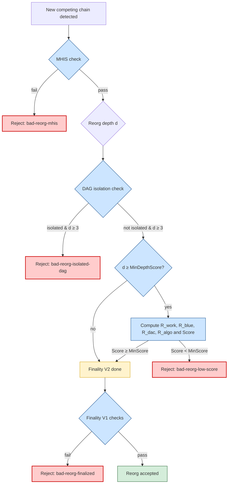

# megabytes-security-model
Security model, finality rules, and reorg-resistance simulations for the Megabytes multi-algo PoW blockchain.

Megabytes is a multi-algorithm Proof-of-Work blockchain integrating a layered
security architecture designed to make deep chain reorganizations (≥ 3 blocks)
practically impossible unless an attacker controls a very large portion of the
global hashrate *across multiple algorithms simultaneously*.

**Simulations indicate that an attacker without ~80–90% of multi-algo hashrate cannot reliably perform reorgs ≥ 3 blocks.**

---



---

This repository documents:

- The **threat model**;
- The **security layers** involved (PoW + DAG + MHIS + Finality V1 + Finality V2);
- The **parameters** and their rationale;
- The **attacker window** (≈ 2 blocks under realistic conditions);
- **Reproducible regtest simulations**.

It also provides reference shell scripts demonstrating how Megabytes responds to:

- Honest small reorgs,
- Deep private forks,
- Mono-algo attacks,
- Multi-algo biased attacks,
- DAG-isolated branches.

---

## 1. Repository description

This repository accompanies the Megabytes Core consensus engine by providing a
**transparent specification** of how chain finality is enforced, how reorgs are
evaluated, and how an attacker’s capabilities are bounded.

It is intended for:

- Protocol auditors
- Researchers studying reorg resistance
- Exchange integrators
- Node operators
- Contributors interested in network security

---

## 2. Threat model

This documentation focuses on **consensus-level safety**: preventing attackers from
rewriting history or performing deep double-spend attacks.

### The attacker is allowed to:

- Control a fraction `f` of global hashrate (possibly large);
- Concentrate effort on **one PoW algorithm** or distribute across many;
- Mine privately and publish a competing chain later;
- Attempt reorganizations of arbitrary depth;
- Stay connected or disconnected from the public DAG.

### Out of scope (for now)

The following are *not* addressed directly by this repository (though they may be
addressed in future Megabytes improvements):

- Network-layer attacks (eclipse attacks, BGP hijacking, ISP-level filtering);
- Very short-term mempool censorship or MEV competition (1–2 block horizon);
- Social attacks (sybil governance, bribery attacks, coordination failures).

These limitations **do not reduce reorg protection**; they merely specify the
boundary of what the consensus engine is responsible for.

---

## 3. Security layers

Megabytes uses a **multi-layer defense model**, where each layer protects against
attacks that slip past the previous one:

1. **Multi-Algorithm Proof-of-Work**

   - Several PoW algorithms contribute to total work.
   - DAG scoring penalizes unnatural multi-algo distributions (e.g. mono-algo attacks).

2. **GHOSTDAG-light (Blue Score)**

   - Provides a DAG-based “honest backbone”.
   - Helps detect branches inconsistent with the global mining graph.

3. **MHIS (Minimum Honest Intersection Set)**

   - Ensures any reorg must overlap significantly with the recent honest mining history.
   - Prevents long-range reorganizations even if they appear DAG-consistent.

4. **Finality V1: Blue Finality + Work Finality**

   - Rejects reorganizations that do not present sufficiently more accumulated work.
   - Blocks reorgs beyond finalized blue blocks.

5. **Finality V2: Isolation Detection + Score Veto**

   Applied for reorgs deeper than a configurable threshold.

   - **Isolated-DAG Veto**  
     If the new branch is DAG-isolated (dac_new ≈ 0), the reorg is rejected immediately.

   - **Score-based Veto**  
     For depth ≥ `nFinalityV2MinDepthScore`, the new chain must achieve

     ```
     Score >= MinScore
     ```

     where:

     ```
     Score = K_Work * R_work
           + K_Blue * R_blue
           + K_DAC  * R_dac
           + K_Algo * R_algo
     ```

     The score incorporates:

     - Work advantage (R_work),
     - DAG quality (R_dac),
     - Blue score consistency (R_blue),
     - Algorithm distribution similarity (R_algo).

   A branch that is too isolated, too mono-algo, or too poorly connected
   to the honest DAG cannot override history.

---

## 4. MHIS: Multi-Height Interval Safety

MHIS (Multi-Height Interval Safety) is the **first protective layer** in Megabytes’ reorganization pipeline.

It guarantees that any competing chain must remain consistent with the recent honest mining history, preventing long-range and structurally invalid reorganizations.

The MHIS layer contains several key components:


1. **History Window Constraint**

   - MHIS inspects the last *W* blocks behind the current height (≈20 by default).
   - Any reorg whose fork point occurs earlier than **H − W** is rejected immediately.
   - This prevents long-range attacks and deeply pre-mined side-chains.

2. **Structural Continuity Requirement**

   - The competing chain must maintain valid:
     - timestamps,
     - inter-block intervals,
     - parent relationships,
     - and historical continuity.
   - If the divergence is too early, compressed, or inconsistent:
     - **MHIS rejects the reorg before Finality V2 or V1 are evaluated.**

3. **Independence from Work or DAG Quality**

   - MHIS does **not** rely on:
     - accumulated work,
     - GhostDAG mergeset structure,
     - algorithm distribution,
     - or score-based evaluation.
   - Even a chain with more PoW or a clean DAG cannot bypass MHIS if its fork lies outside the window.


4. **Protection Against Long-Range Attacks**

   - An attacker cannot mine tens or hundreds of blocks privately and publish them later.
   - Forks outside the history window are automatically invalid.


5. **Protection Against Deep Private Side-Chains**

   - Private chains of 15–20 blocks inevitably cause:
     - timestamp drift,
     - parent mismatches,
     - or compressed historical patterns.
   - MHIS detects these anomalies and rejects the reorg.


6. **Prevention of Finality V1 Bypass**

   - Finality V1 normally requires the attacker to provide significant work advantage.
   - MHIS eliminates deep reorg attempts **before** the work comparison is even applied.
   - Reorgs deeper than the window (≈20 blocks) are **unconditionally forbidden**.


### **Summary**

- **MHIS enforces temporal proximity**  
  → Only short, recent reorgs are possible candidates.

- **Finality V2 enforces structural and behavioral legitimacy**  
  → DAG isolation, score veto, multi-algo distribution, DAC coherence.

- **Finality V1 enforces economic weight**  
  → Work-lead rule and blue-finality consistency.

Together, these layers make Megabytes highly resilient to:

- long-range attacks,  
- private mining attacks,  
- deep reorganizations,  
- multi-algo manipulation,  
- and historically inconsistent forks.

---

## 5. Finality V1 vs Finality V2 (Practical Role)

Megabytes maintains two complementary finality layers:

- **Finality V1**, inherited from the underlying chain (blue-finality + work-finality),
- **Finality V2**, a new structural and behavioral veto model built on DAG analysis.

Although both layers remain active, their practical roles differ significantly.
Finality V2 typically intercepts deep or malicious reorganizations
*before* Finality V1 ever needs to evaluate them.

The interaction between the two layers can be summarized as follows:


5.1 **Finality V1: Economic and Blue Finality**

   - Evaluates whether a competing chain presents **significantly more accumulated work**.
   - Enforces **blue-finality**, preventing reorgs past finalized blue blocks.
   - Historically essential in PoW chains to prevent deep reorganizations.
   - Acts as the **final arbiter** when V2 places no veto.


5.2 **Finality V2: Structural and Behavioral Finality**

   Finality V2 applies a series of veto conditions based on
   DAG structure, connectivity, and algorithm behavior.

   Megabytes uses two key thresholds:

   - **Depth ≥ 3 → Isolated-DAG Check (Hard Veto)**
     - If the competing branch is DAG-isolated (e.g., privately mined or poorly connected),
       the reorg is rejected unconditionally.

   - **Depth ≥ `nFinalityV2MinDepthScore` (typically 3) → Score Threshold**
     - The new chain must satisfy:
       ```
       Score >= MinScore
       ```
       where the score aggregates:
       - work advantage,
       - blue-score coherence,
       - DAG connectivity quality,
       - and multi-algorithm distribution similarity.

     - Chains that are too mono-algo, structurally weak, or poorly integrated
       with the honest mining graph are rejected.


5.3 **Why Finality V2 Usually Acts First**

   - Reorgs deeper than **2 blocks** almost always trigger V2’s isolation or scoring logic.
   - If a reorg is suspicious structurally (isolated DAG) or behaviorally (bad algo mix),
     V2 rejects it before Finality V1 evaluates work.
   - As a result, **deep reorg attempts almost never reach Finality V1** in practice.


5.4 **Finality V1 as a Secondary Safety Net**

   - Finality V1 still guards the system, but functions primarily as a **backup layer**.
   - If a candidate chain passes all V2 checks but still lacks the work or blue chain legitimacy,
     Finality V1 rejects it.
   - This layered approach ensures that both **economic weight** and **structural legitimacy**
     are required for history rewrites.

5.5 **Practical Summary**

   - **Finality V2 stops malicious or structurally abnormal reorgs early.**
   - **Finality V1 stops insufficient-work reorgs that pass V2.**
   - Together, they ensure:
     - deep reorganizations are practically impossible,
     - privately mined forks cannot override honest history,
     - multi-algorithm manipulation is penalized,
     - and work-finality remains intact as a final guarantee.

In practice, **Finality V2 is the effective barrier** for preventing deep chain reorganization,
while **Finality V1 acts as a final, economic-based safeguard**.

---


## 6. Parameters (example configuration)

```cpp
nFinalityV2MaxDepth       = 100;
nFinalityV2MaxWindow      = 400;

dFinalityV2KWork          = 0.10;
dFinalityV2KBlue          = 0.20;
dFinalityV2UnitWork       = 1.0;

dFinalityV2KDAC           = 2.0;
nFinalityV2DACMinDepth    = 3;
dFinalityV2DACEps         = 1e-6;

dFinalityV2KAlgo          = 3.0;
dFinalityV2AlgoEps        = 1e-3;

nFinalityV2MinDepthScore  = 5;
dFinalityV2MinScore       = 0.5;
 ```

## Interpretation of parameters

- Reorgs deeper than 2 blocks are treated as suspicious.  
- For depth ≥ 3, DAG isolation may immediately veto the reorg.  
- For depth ≥ 5, the score threshold must be met.  
- A deep reorg must therefore be:
  - DAG-connected  
  - Work-dominant  
  - Realistic in algorithm distribution  
  - High-quality in all R_* metrics  

Without these, the reorg is rejected by V2.

---

### Attacker window (≈ 2 blocks)

With these parameters:

#### ✔️ Honest reorgs (1–2 blocks)

These remain possible and represent normal PoW behavior:

- Two blocks found simultaneously,  
- Network delay,  
- Miner desynchronization.

#### ❌ Deep reorgs (≥ 3 blocks)

These face multiple barriers:

- If mined privately → **isolated-DAG ⇒ reject**
- If mined publicly:
  - Must **outwork** the honest chain,
  - Must maintain **DAG quality**,
  - Must preserve **realistic multi-algo ratios**,
  - Must pass **Finality V1 + Finality V2** scoring.

This provides **early practical finality** while preserving PoW decentralization.


---

## 7. Conditions of Veto

| Reorg depth | V1 - V2 checks                 | Outcome                                   | Notes |
|-------------|---------------------------|--------------------------------------------|-------|
| MHIS          | Always evaluated (all depths)    | Reject if MHIS window not satisfied         | Prevents long-range or history-divergent chains |
| d < 3       | No V2 veto                | Decided by PoW + Finality V1              | Honest reorg window |
| 3 ≤ d < 5   | DAG isolation only        | Reject if isolated                         | Blocks private forks |
| d ≥ 5       | Isolation + score checks  | Reject if isolated or Score < MinScore     | Requires strong attacker |
| d ≥ 20      | Finality V1 work-lead rule          | Reject unless Work(new) ≥ Work(old) + 20      | Deep reorgs ≥20 blocks effectively impossible |

---


### 8. Regtest simulations (reproducible)

Scripts in the `scripts/` directory allow anyone to verify Megabytes’ security assumptions:

- **regtest_reorg_honest_2blocks.sh**  
  Simulates a small honest 1–2 block reorg.  
  **Expected:** *ACCEPTED by FinalityV1 + FinalityV2.*

- **regtest_attack_mono_algo_25blocks.sh**  
  Simulates a deep mono-algo attack.  
  **Expected:**  
  - **Isolated-DAG veto**, or  
  - **Score < MinScore**, leading to `bad-reorg-low-score`.

- **regtest_attack_multi_algo_biased.sh**  
  A subtle attack using an unrealistic algorithm distribution.  
  **Expected:** rejected unless the attacker controls overwhelming multi-algo hashrate.

- **regtest_reorg_isolated_dag_example.sh**  
  Demonstrates how a branch mined even partially offline becomes **isolated**  
  and is correctly rejected.

Each script prints **FinalityV2-\*** log lines and explains how to interpret them.

---

### 9. Future improvements

Areas under active research:

- Network-layer hardening (anti-eclipse mechanisms);
- Adaptive **MHIS** thresholds for stronger long-range protection;
- Advanced multi-algo anomaly detection (machine-learning assisted?);
- Optional stake-weighted finality overlays.

Megabytes’ philosophy is **progressive hardening**: transparent, incremental and empirically validated.


